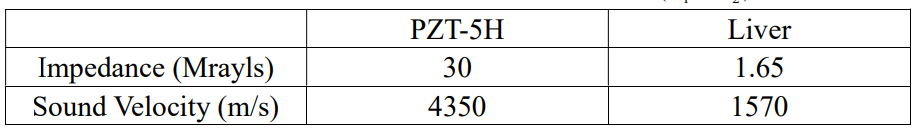

# HW1

## Problem 1

Design a transducer using PZT-5H with a center frequency of 8 MHz

1. What should the thickness of the PZT-5H layer be?

2. To insert a single impedance matching, find its characteristic impedance for liver imaging
(ignore sound propagation in skin and fat).

3. Assuming the propagation speed of sound waves in the matching layer is 2500 m/s, what isthe thickness of the matching layer.

4. Prove that the energy transmission from the PZT-5H to the liver is improved by the matching layer.
(Hint: intensity transmission coefficient $=\frac{4Z_1Z_2}{(Z_1+Z_2)^2}$)

## Problem 2

Re-evaluate Problem 1(b) and 1(d) when a two-layer matching is considered. Here,characteristic impedance should be $Z_{m1}=\sqrt[3]{Z_1^2Z_2}$ and $Z_{m2}=\sqrt[3]{Z_1Z_2^2}$, respectively for the first and the second matching layer.

## Problem 3

For the transducer operating at 5 MHz for detecting a tissue-bone interface that is 10 cm deep in tissue ($Z_{tissue}=1.5 Mrays$, $Z_{bone}=7.5 Mrays$, $\alpha tissue=0.6$ dB/cm/MHz)

1. Calculate the total loss of acoustic intensity in decibels (dB) for the echo generated at the tissue-bone interface relative to that of the transmitted intensity. Please combine the reflection loss together with the attenuation loss.
(Hint: intensity reflection coefficient $=\frac{(Z_2-Z_1)^2}{(Z_1+Z_2)^2}$)

2. Calculate the intensity of the reflected echo in (a) in unit of $W/cm^2$ if the transmittedintensity is 8 $W/cm^2$.
