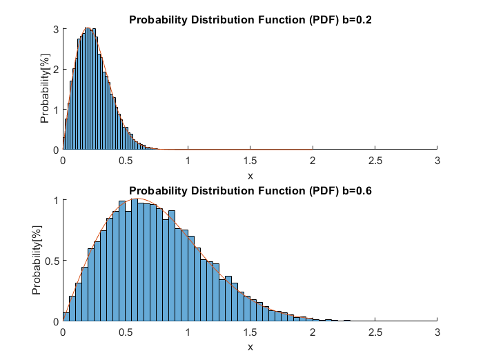
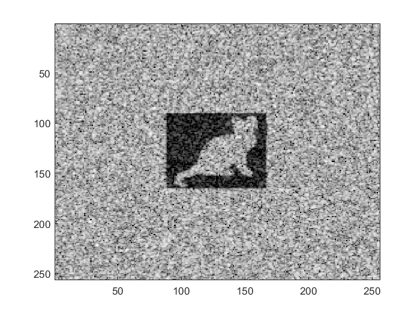
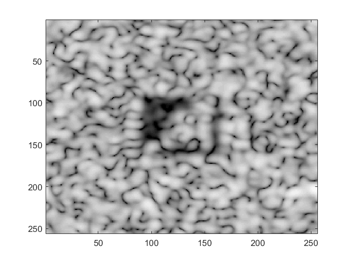
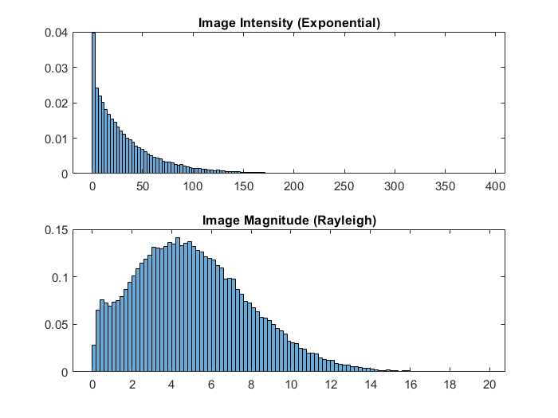

# HW2

Using ``Matlab`` to coding and saving to [HW2.m](HW2.m).

## Problem 1

For the build-in function raylrnd.m in MATLAB

1. Explain how the function generates the random array with Rayleigh distribution.
Compare the results with what you have learned from the lecture.

2. Demonstrate the histogram of the random array in pdf format of two different b values. Please compare your histogram with that from another build-in function raylpdf.m. Does the histogram comply with Rayleigh distribution?

## Problem2

For the image simulation program genImage_VariousShapeCyst.m

1. Make your own cyst image with at least two different definitions of PSF (bw_x and bw_y) when cystdB = -20 dB. Describe how the PSF changes the speckle image.

2. Make your own cyst image with cyst contrast (cystdB) of -3, -6 and -20dB when bw_x=bw_y=6. Describe how the detectability of cyst changes with cyst contrast.

3. Demonstrate the histogram of the image intensity in a uniform background region and check whether its distribution comply with Exponential.

4. Calculate the speckle SNR and compare your result to the theoretical value. (i.e., SNRI=1 or SNRE=1.91)

