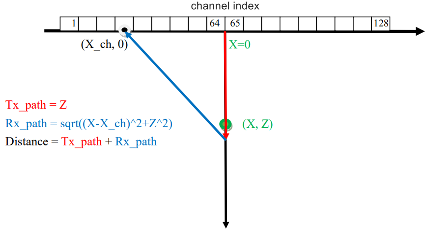
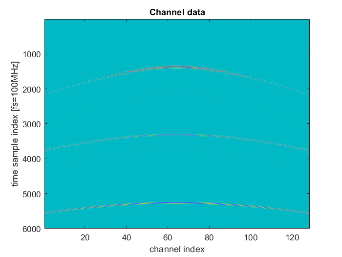
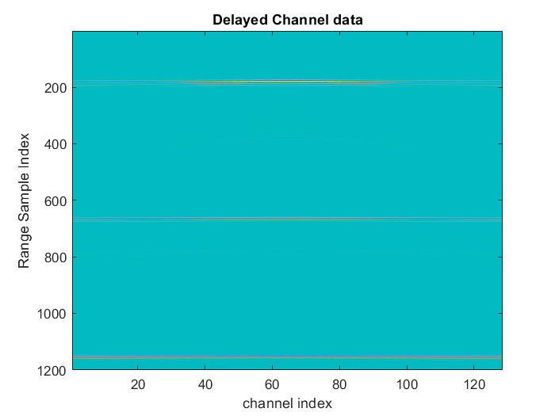
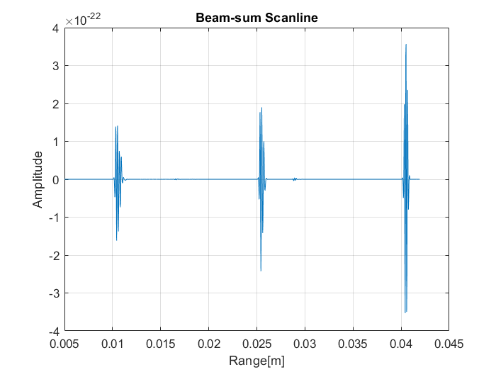
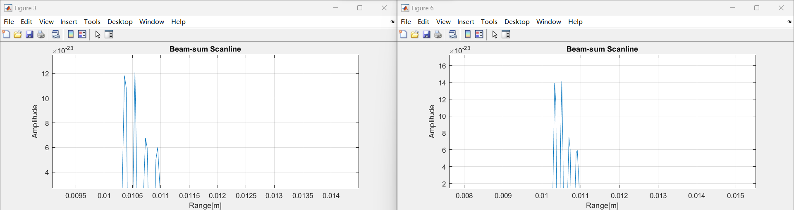

# HW3

Using ``Matlab`` to coding and saving to [HW3.m](HW3.m)

## Problem 1

Given the received channel data by a 128-channel linear array with sampling frequency of 20 MHz and 100 MHz from three reflectors in the central scanline (i.e., X=0) at range of 10, 25 and 40 mm, perform the delayand-sum beamforming for the central scanline and demonstrate your beam-sum scanline waveform.

1. Explain in details how your delay-and-sum program is developed.

2. Compare the amplitude of beam-sum scanline waveform at different sampling frequency (**20MHz** and **100MHz**) and discuss why they differ?

