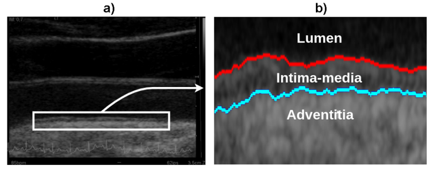
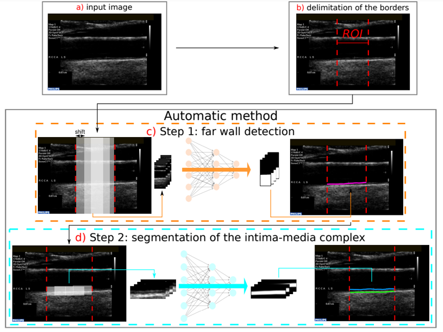

# HW4

Final presentation

[Segmenting the carotid-artery wall in ultrasound image sequences with a dual-resolution U-net](https://ieeexplore.ieee.org/abstract/document/9957590)

## Motivation

### cardiovascular diseases 心血管疾病

* Atherosclerosis 動脈硬化
* Arterial wall thickening動脈壁增厚
* 量測IMC的輪廓

### Prevention 預防檢查

* non-ionizing 非游離輻射
* inexpensive 便宜
* Ultrasound Image

## Proposed method

Proposed method: **caroSegDeep**

cascade two **U-nets**

## Result

* IMC segmentation can be accurately and robustly performed using U-nets.

* the proposed method is based on supervised learning, it has the potential to increase its performance by using larger and more diverse data for training.

* the largest errors occurred in the presence of calcified plaques, which were present in few images.
